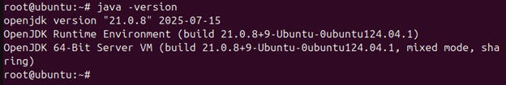
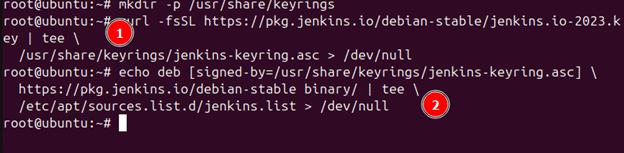
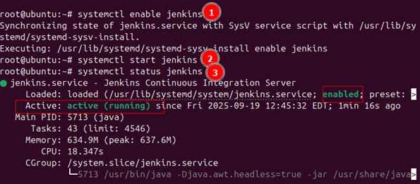
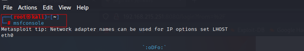

## Introduction
Jenkins penetration testing is essential for uncovering security vulnerabilities within Jenkins, an open-source automation server widely used for continuous integration (CI) and continuous delivery (CD). Built on Java, Jenkins provides a scripting-based platform to automate key stages of the software development lifecycle, including building, testing, and deployment. This automation accelerates development cycles, enhances code quality, and streamlines release processes. Notable features include CI/CD pipeline automation, integration with version control systems, support for automated testing, extensive plugin extensibility, and robust monitoring and reporting capabilities.

we will be installing Jenkins on a Ubuntu Vm and attack it from a Kali Vm to get a remote code execution.

## Setting Up the Environment
- **Victim:** Ubuntu server  
  
- **Attacker:** Kali Linux  
  

## Installing Java
we will run the following commands:
- sudo apt update.
- sudo apt install openjdk-11-jre.

- java -version
 

---

## Add Jenkins Repository
Now, let us import the Jenkins GPG key. 
- We will first create the keyrings folder using the command below.
- mkdir -p /usr/share/keyrings.
- then run the command below.
-  curl -fsSL https://pkg.jenkins.io/debian-stable/jenkins.io-2023.key | tee
/usr/share/keyrings/jenkins-keyring.asc > /dev/null.

Once imported, we can add the Jenkins repo with this command.
- echo deb [signed-by=/usr/share/keyrings/jenkins-keyring.asc] https://pkg.jenkins.io/debian-stable
binary/ | tee /etc/apt/sources.list.d/jenkins.list > /dev/null

---

## Install Jenkins
Let us first update the system by running:
- Apt update -y
  

then install Jenkins.
- apt install -y jenkins

then run:
- systemctl enable jenkins
- systemctl start jenkins
To enable and check the status of Jenkins.

## Jenkins Web Setup
We will open a web browser and navigate to http://<your-server-ip>:8080 to access Jenkins from the web interface. We will be presented with a page that says we need an admin password, and we can obtain an initial password using this command.
 cat /var/lib/Jenkins/secrets/initialAdminPassword

Open browser:  
`http://<your-server-ip>:8080`  

We will go ahead and retrieve the password in the given file.

Get admin password:
cat /var/lib/jenkins/secrets/initialAdminPassword

Copy and paste the password.

Install suggested plugins:  

Once logged in, select the suggested plugins to customize and go ahead with the installation.

Wait for it to install everything.

Once everything is installed, it will ask us to it will ask us to the First Admin user and a password.
Set up first admin user:  

Copy the configured URL:  

## Enumeration & Attack Setup

We have installed the Jenkins server and configured it on the Ubuntu machine. Now we will use Kali to perform an attack on Jenkins. To start the attack, we need to first enumerate the Jinkins server and check if we can access it from the attacking machine using a web browser. As we have seen before, Jinkins is running on port 8080, so all we need to do is go to http://<your-server-ip>:8080.

Access Jenkins login from attacker:  

## Metasploit Exploitation

Launch Metasploit:
Once we confirm that Jenkins can be accessed from the machine, we will use Metasploit to get a reverse shell connection from the Victim machine (Jenkins Server).

Find exploits:
We will try to attack the Jenkins login form, so for that we will use this command search jenkins login inside Metasploit.

Choose module:
We will then use the command use 0 to interact with the Jenkins.

From here, we have a chance to interact with the module with Metasploit as shown in the screenshot below.

Get credentials, then search for script console exploits:
Once we run the above command, we can see the username and the password have been revealed to us. We will use this credential to exploit the victim. 
The first thing we will do is search for a Jenkins exploit in the module so we can use it.
We will use the command search jenkins script console

As shown above, we have three different exploits. We will use exploit number 3 as it targets Linux OS since our Jenkins is hosted on an Ubuntu server.

Choose Linux exploit:

We will then configure and use the exploit using the commands in the screenshots below.

As we can see in the screenshot above, we got a reverse shell once the exploit ran successfully. 
Now that we have a meterpreter session, we can run a few commands in the system we have gained access to, so we can confirm that we are, in fact, in the system. 

## Manual Exploit: Groovy Script Console.

Now that we have obtained the username and password of the Jenkins server, we can log into the Jenkins web interface from the browser. 
Once you log in, go to settings on the top right corner and scroll down until you find script console.

Click on the Script console, and you will see this screen.

This is a groovy script terminal which allows you to run a Groovy script. A Groovy script is a program written in Groovy, a dynamic scripting language that runs on the Java Virtual Machine (JVM). It is designed to be a more concise and expressive alternative to Java for certain tasks, while still leveraging the full power of the Java ecosystem.

We will use a Groovy reverse shell script to get a reverse shell. We will just go to https://www.revshells.com and then generate a script from there.

Once we put our attacking machine IP and the port and select Groovy, we will get a reverse shell script, and we can copy it.

Paste the script in the Jenkins script console, but don’t run it yet.

Let's first confirm that we have netcat running at port 443. Use this command in the attacking machine to confirm Netcat is running.

rlwrap nc -lnvp 443.

Once confirmed, go to Jenkins and run the script in the Jenkins console. After running the script, we get a connection from the victim machine (Jenkins).

## Conclusion
In conclusion, this exercise on Jenkins demonstrates how attackers can exploit these servers to obtain a reverse shell, highlighting the importance of robust security measures. Weak or missing authentication exposes Jenkins servers to serious risks, underscoring the need for robust protection. Organizations should implement strict access controls, perform routine security assessments, and keep their systems up to date to minimize the risk of unauthorized entry and potential exploitation.

